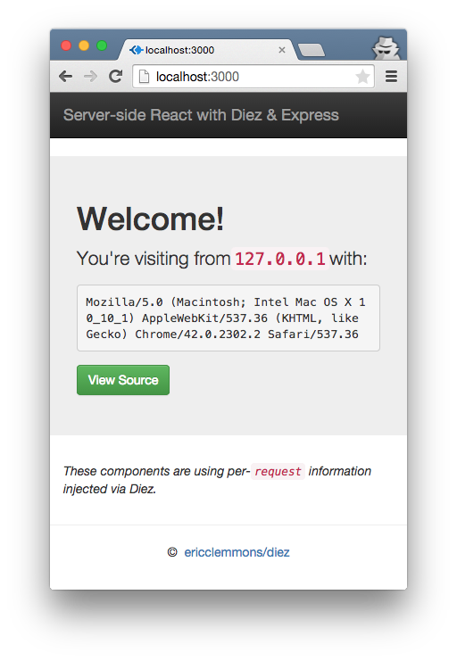

# Server-side React with Diez & Express

> 

### [Demo][4] ([source][5])


### Usage

Run:

```
.../examples/express $ node server.js
```

Open:

> <http://localhost:3000/>

[4]: https://protected-castle-7387.herokuapp.com/
[5]: https://github.com/ericclemmons/diez/tree/master/examples/express
